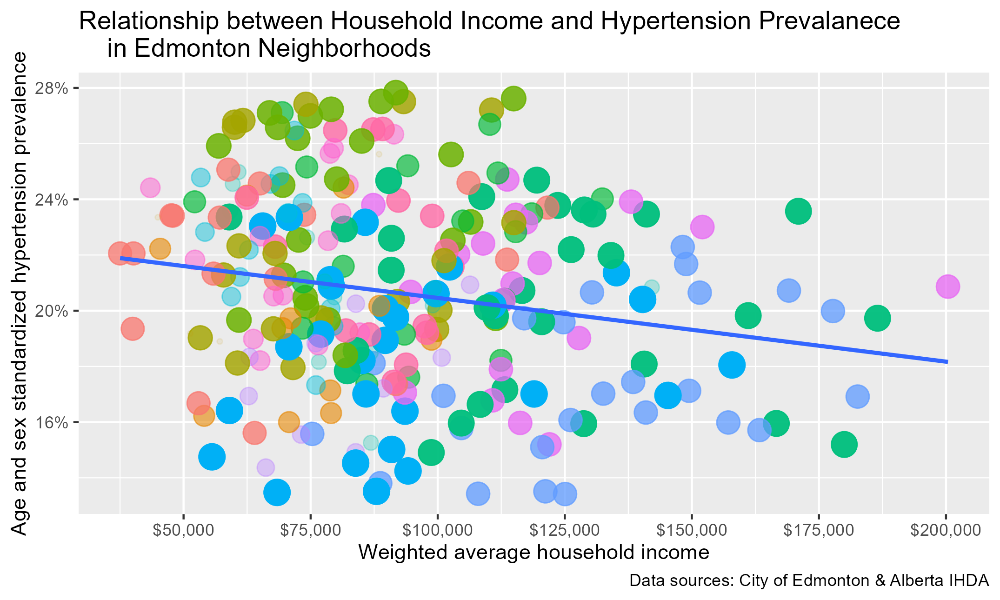
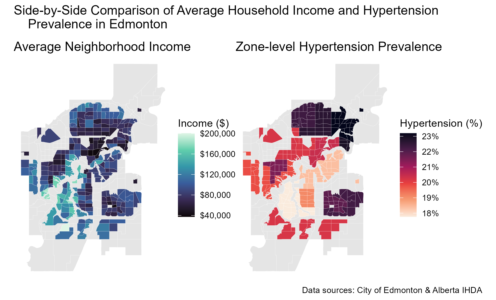

# Edmonton Health Equity: A Spatial Analysis of Income and Hypertension
**Author:** Mike Zhang

## Project Overview
For my first-ever formal GitHub repository AND self-directed data analytics project, the goal is to practice the whole GitHub workflow while analyzing the relationship between neighborhood socioeconomic status (income) and chronic health outcomes (hypertension) in Edmonton, AB.

The core challenge involved in the project is **mismatched spatial data** between neighborhood-level income data (n = 388) and zone-level hypertension data (n = 15)

## Tech Stack & Methodology
- **Language:** R
- **Version Control:** Git/GitHub
- **Crosswalk Preparation & Data Joining:** generated a look-up table with the available information to join the predictor and outcome datasets and retain as much information as possible
- **Spatial Data Manipulation & Visualization (sf + ggplot):** joined granular income data with broader hypertension data and mapped spatial data using geom_sf
- **Weighted Simple Linear Regression (lm):** aggregated the neighborhood-level predictor(income) to the zone level and performed simple regression on zone-level data weighted on zone populations
- **Model Correction (lmtest + sandwich):** applied robust clustered standard errors to account for the nested non-aggregated data (neighborhoods within SLGAs), the mismatch in resolution between predictor and outcome data, and heteroskedasticity
- **Spatial Residual Mapping**: binned model residuals into categories to identify positive and negative "outliers" and joined them back to the original sf object for visualization

## Key Visualizations

## Datasets
- **Sources:** City of Edmonton Open Data, Alberta IHDA
- **Year:** 2016, but part (Edmonton neighborhood boundaries) of the bridging crosswalk is from the present
- **Key Variables:**
    *Neighborhood-level Household Income (mid-points from binned data)*
    *SLGA-level Hypertension Status*
    *Polulation*
    *Neighborhood*
    *SLGS*
- **Sources:**
    * https://data.edmonton.ca/Census/2016-Census-Population-by-Household-Income-Neighbo/jkjx-2hix/about_data 
    * http://www.ahw.gov.ab.ca/IHDA_Retrieval/selectCategory.do 

