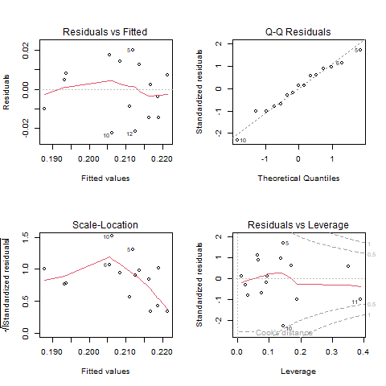
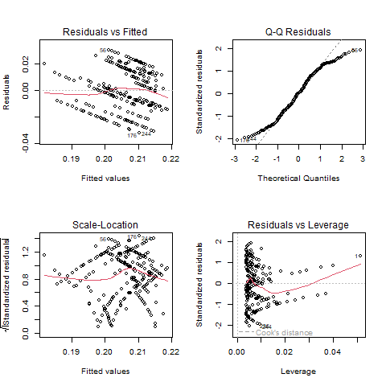

```{r}
#| label: setup
#| include: false
library(tidyverse)
library(gt)
library(gtsummary)
```

# Introduction

The relationship between socioeconomic status and health outcomes is well-documented. As a MPH candidate who is into data analytics and data science, I initiated this self-directed practice project to both practice data techniques and examine this relationship in a more specific context. Thanks to Edmonton's open data and Alberta IHDA, I was able to investigate the income-hypertension relationship. Hypertension is a common chronic condition and a meaningful health outcome to study at the population level. Besides familiarizing myself with the data analytics workflow, the goal of this analysis is to examine whether that income-health relationship holds at the zone level in Edmonton using 2016 data, which is complicated by a mismatch in spatial resolution between the two datasets that will be addressed in the following sections.

# Data

## Income Data

```{r}
#| label: income data
#| include: false
yeg_income <- read_csv("data/data_raw/2016_yeg_census_household_income.csv")
yeg_income_tidy <- read_rds("data/data_clean/tidy_2016_yeg_census_household_income.rds")
```

The original household income data (`yeg_income`) are from 2016 Edmonton Census, accessed through City of Edmonton Open Data, and are specific to each ward of every neighborhood. The original dataset is in wide format and is tidyed into long format for visualization and analysis (n = `r nrow(yeg_income_tidy)`). The 'No response' category of household income is filtered out, but for neighborhoods, such as Rutherford, the proportion of nonresponders is rather large and possibly not missing at random, which could be problematic.

## Hypertension Data

```{r}
#| label: hypertension data
#| include: false
yeg_hypertension <- read_csv("data/data_raw/2016_lga_standardized_hypertension_prevalence.csv")
```

The 2016 hypertension prevalence data (`yeg_hypertension`) is downloaded from Alberta IHDA under the section of 'chronic diseases.' To help eliminate age and sex-related confounding, all prevalence rates in the dataset are age and sex standardized, and are grouped by Sub-Local Geographic Area (SLGA) based on AHS's definition and contain SLGAs across all Alberta (n = `r nrow(yeg_hypertension)`). Standardization allows fair comparison across zones with different demographic compositions.

## GeoJSON Data

The two GeoJSON files (`geojson_files/yeg_neigh.geojson` and `geojson_files/yeg_slga.geojson`), which are Edmonton neighborhood boundaries and SLGA boundaries downloaded from the Edmonton City Open Data Portal and AHS' Geographic Information Systems (GIS). However, they both reflect the current reality of Edmonton neighborhoods and SLGAs, which may not completely align with their geographical boundaries in 2016.

## The Spatial Mismatch Problem

```{r}
#| label: joined data
#| include: false
yeg_joined <- read_rds("data/data_clean/yeg_joined.rds")
```

Due to the fact the predictor/income data (`yeg_income`) and the outcome/hypertension data (`yeg_hypertension`) have different data resolutions with the former on the neighborhood level while the latter on the SLGA level, a crosswalk is needed to join the two datasets. Detailed description of how the crosswalk is constructed is discussed below.

# Methods

## Income Estimation

Since the household income variabe is binned in my dataset, I proceeded to use the mid-point of each bin as a rough estimate. For the open-ended top bin, I opted to multiply the lower bound by 1.25 for conveience, which might be inaccurate, and that is one of the problems dealing with census data. Weighted average household income of each neighborhood is then calculate using the formula `sum(income_midpoint * n_person) / sum(n_person)` after grouped the data by neighborhoods instead of wards.

## Crosswalk Construction

By joining the two geoJSON files and then dropping their geometries, I created the crosswalk with neighborhoods nested within their corresponding SLGAs. However, several inconsistencies and mismatches are spotted potentially due to different years used or categorization rules among the crosswalk. After iterations of identifying problems, such as symbol & vs. and, partial matches, and fuzzy suffixes as well as prefixes, I eventually ended up with `r nrow(yeg_joined)` observations and made the the judgement call that it's high-fidelity enough for my analysis.

## Modeling Approach

Again, since the two data I joined have different resolutions (neighborhood vs. SLGA), a typical mixed-effect approach for nested data using `lme()` is not applicable as there's virtually no within-SLGA variance in hypertension prevalence rate. Also, a simple linear regression with `lm()` is also inaccurate due to violation of independence assumption (neighborhoods nested in SLGAs). Consequently, I first proceeded to carry out a simple linear regression on the aggregated data, where average household income is calculated on the SLGA level and weighted by neighborhood populations. However, the model loses a huge chunk of information (n = `r nrow(yeg_hypertension)`), and the diagnostic plots show signs of heteroskedasticity.



A clustered robust standard error approach is conducted on the original simple linear model, which has more acceptable diagnostics, to solve both issues of heteroskedasticity and nested data.



## Residual Mapping

Thanks to the geoJSON files, a spatial residual plot is made to display model performance geographically. By binning the model residuals based on the standard deviation (± 1 SD of residuals), I then created the map where SLGAs with hypertension rate higher or lower than what the model predicts are highlighted by different colors, which will be showed in the Spatial Patterns section. 

# Results

## Descriptive Statistics

```{r}
#| label: tbl-descriptive
#| tbl-cap: "Descriptive statistics for key variables by zone"
yeg_joined_aggregated <- read_rds("data/data_clean/yeg_joined_aggregated.rds")
yeg_joined_aggregated |> 
  select(-geography) |> 
  mutate(
    weighted_average_income = weighted_average_income_10k * 10000,
    .keep = "unused"
  ) |> 
  tbl_summary(
    statistic = list(all_continuous() ~ "{mean} ({sd}) [{min}, {max}]"),
    label = list(
      weighted_average_income ~ "Weighted Average Income ($)",
      age_standardize_rate ~ "Hypertension Prevalence (%)",
      population ~ "Zone Population"
    )
  )
```

As shown in the tabel, zone-level average household income weighted by population ranges from \$62,151 to \$131,608, suggesting substantial socioeconomic variation across Edmonton. Hypertension prevalence similarly varied from about 18% to 23%. Zone populations differed considerably, which motivates the use of population weights in the regression.

## Income and Hypertension: Correlation

```{r}
#| label: scatter-plot
#| fig-cap: "Relationship between household income and hypertension prevalence across Edmonton neighborhoods (colored by SLGA zones)"
yeg_joined <- read_rds("data/data_clean/yeg_joined.rds") |> 
  mutate(
    age_standardize_rate = age_standardize_rate / 100, # Convert to decimals 
    geography = factor(geography )
  ) |> 
  ungroup()
yeg_joined |> 
  ggplot(aes(x = weighted_average_income, y = age_standardize_rate)) + 
  geom_jitter(aes(alpha = population, size = population, color = geography), height = 0.002) +
  geom_smooth(method = "lm", se = FALSE) +
  scale_x_continuous(
    breaks = seq(25000, 200000, by = 25000),
    labels = scales::label_dollar()
  ) +
  scale_y_continuous(
    labels = scales::label_percent()
  ) +
  theme(legend.position = "none") +
  labs(
    title = "Relationship between Household Income and Hypertension Prevalence 
    in Edmonton Neighborhoods",
    x = "Weighted average household income",
    y = "Age and sex standardized hypertension prevalence", 
    caption = "Data sources: City of Edmonton & Alberta IHDA"
  ) 
```

Since the hypertension prevalence is on the zone level, slight jitter is added to prevent overplotting. Similarly, alpha and size of data points are also adjusted according to neighborhood population. The direction of the relationship is expected according to the scatter plot and smooth line: household income is negatively correlated to hypertension prevalence in Edmonton zones. The spread among certain zones are quite evident.

## Regression Results

```{r}
#| label: tbl-regression
#| tbl-cap: "Regression model summary"
library(broom)
library(knitr)
yeg_model_robust <- read_rds("output/yeg_model_robust.rds")
yeg_model_robust |>
  tidy() |> 
  rename(
    Term = term,
    Estimate = estimate,
    Std.err = std.error,
    Statistic = statistic,
    P_value = p.value
  ) |> 
  kable(digits = 5)
```

Results of the final regression model using the clustered robust standard error is displayed on the table above (260 neighborhoods within 15 zones). The output shows that household income is significantly related to hypertension prevalence rate in Edmonton (p = 0.0056). Specifically, an \$10,000 increase in household income is associated with a 0.23 percentage point decrease in hypertension prevalence rate in Edmonton SLGAs.

## Spatial Patterns

```{r}
#| label: fig-maps
#| fig-cap: "Side-by-side comparison of household income and hypertension prevalence in Edmonton"
#| fig-width: 12
library(sf)
library(patchwork)
neigh <- st_read("geojson_files/yeg_neigh.geojson", quiet = TRUE) 
yeg_joined <- yeg_joined |> 
  mutate(neighbourhood_number = as.character(neighbourhood_number))
map_data <- neigh |> 
  left_join(yeg_joined, by = "neighbourhood_number") 
p1 <- map_data |> 
  ggplot() +
  geom_sf(aes(fill = weighted_average_income), color = "white", size = 0.05) +
  scale_fill_viridis_c(
    option = "mako", 
    name = "Household Income($)", 
    labels = scales::label_dollar(),
    na.value = "grey90") +
  labs(title = "Average Neighborhood Household Income") +
  theme_void()
p2 <- map_data |> 
  mutate(
    age_standardize_rate = age_standardize_rate / 100
  ) |> 
  ggplot() +
  geom_sf(aes(fill = age_standardize_rate), color = "white", size = 0.05) +
  scale_fill_viridis_c(
    option = "rocket", 
    direction = -1, 
    name = "Hypertension (%)", 
    labels = scales::label_percent(),
    na.value = "grey90"
    ) +
  labs(title = "Zone-level Hypertension Prevalence") +
  theme_void()
p1 + p2 + 
  plot_annotation(
    title = "Side-by-Side Comparison of Average Household Income and Hypertension 
    Prevalence in Edmonton",
    caption = "Data sources: City of Edmonton & Alberta IHDA"
  )
```

```{r}
#| label: fig-residuals
#| fig-cap: "Spatial residual map: neighborhoods performing above and below model expectations"
map_residuals_binned <- read_rds("data/data_clean/residuals_data")
map_residuals_binned |> 
  ggplot() +
  geom_sf(aes(fill = residuals_binned), color = "white", size = 0.1) +
  scale_fill_manual(
    values = c(
      "Lower than Expected" = "#2c7bb6",  
      "As Expected" = "#ffffbf",         
      "Higher than Expected" = "#d7191c", 
      "No Data" = "#d3d3d3"
    ),
    name = "Hypertension Prevalence"
  ) +
  theme_void() +
  labs(
    title = "Model Performance Map by Edmonton Neighborhoods",
    caption = "As expected defined as within ± 1% prevalence"
  )
```

Based on the side-by-side comparison plot, Twin Brooks zone seems to have the lowest hypertension prevalence and highest household income among the SLGA zones. On the other hand, Abbottsfield has the second highest hypertension prevalence with the lowest household income. Some zones with low hypertension prevalence tend to cluster around the central part of Edmonton. The spatial residual plot shows that most neighborhoods have hypertension prevalence rates expected by the model. However, there are a few neighborhoods that are off by more than one standard deviation of the model residuals.

# Discussions

Overall, there's a negative relationship between household income and hypertension prevalence in Edmonton neighborhoods and zones. However, the magnitude of the relationship isn't that evident due to relatively small variance in age- and sex-standardized hypertension prevalence rates to begin with. One thing that is worth noting is that the data are all aggregated at either neighborhood or zone level, meaning that no inference should be drawn at individual-level to avoid ecological fallacy. The relatively narrow range of hypertension prevalence (18% to 23%) as well as lack of variance across neighborhoods makes it tough to model with a sole predictor.

# Limitations

Several limitations exist for this analysis besides the aforementioned spatial mismatched between predictor and outcome data. First of all, the data analyzed are from 2016 and the might differ from today's reality, of which one aspect is the reclassified/expanded neighborhoods and zones in the current jeoJSON files used to create the crosswalk. In addition, though the prevalence is age- and sex-standardized, income is the only predictor and mostly likely not the only factor that influences hypertension prevalence in the real world. Another problem is that household income data are from census and binned. Mid-points of bins as well as 1.25 times the lower boundary of the top open-ended bin are used as a rough estimate for average income calculation, but they might be susceptible to measurement errors.

# Conclusions

In conclusion, this mini self-directed spatial analysis projects illustrates the negative relationship between household income and hypertension prevalence in Edmonton in the year 2016. It helps the author practice the whole GitHub workflow, exercise data analytics techniques, and barely adds anything to the abundant current literature on health inequity. Follow-up analyses after the most up-to-date data are made available could be an interesting next-step to examine whether this inequity is amplified or alleviated in 2026.

# References

Alberta IHDA: <http://www.ahw.gov.ab.ca/IHDA_Retrieval/>

AHS Geographical Information Systems: <https://ahs-geographic-information-systems-ahs.hub.arcgis.com/>

City of Edmonton Open Data Census: <https://data.edmonton.ca/Census/2016-Census-Population-by-Household-Income-Neighbo/jkjx-2hix/about_data>

City of Edmonton Open Data Neighborhood Boundaries: <https://data.edmonton.ca/City-Administration/City-of-Edmonton-Neighbourhoods/65fr-66s6/about_data>
