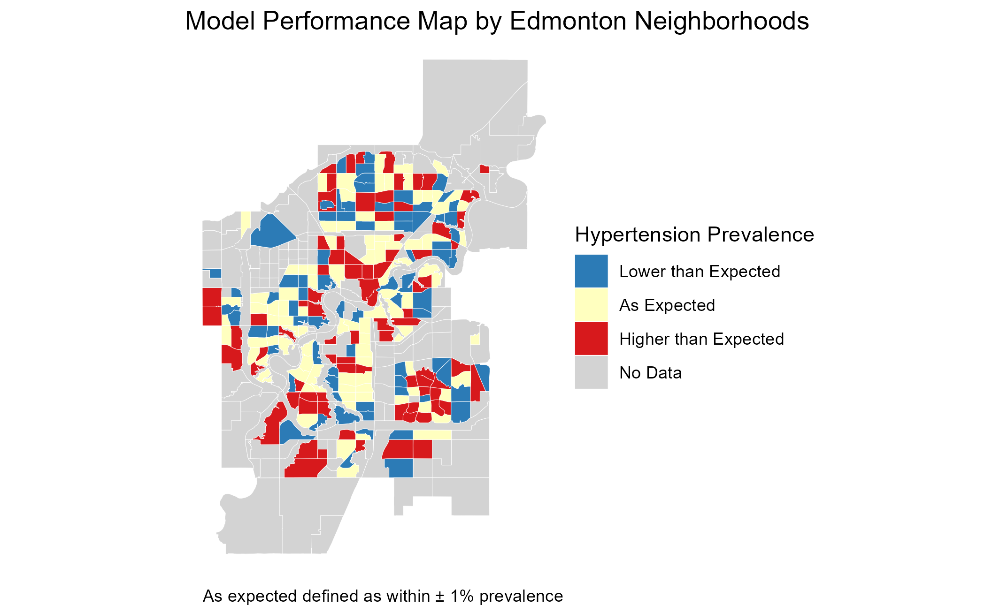

```{r}
#| label: setup
#| include: false
library(tidyverse)
library(gt)
library(gtsummary)
```

# Introduction

# Data

## Income Data

```{r}
#| label: income data
#| include: false
yeg_income <- read_csv("data/data_raw/2016_yeg_census_household_income.csv")
yeg_income_tidy <- read_rds("data/data_clean/tidy_2016_yeg_census_household_income.rds")
```

The original household income data (`yeg_income`) are from 2016 Edmonton Census, accessed through City of Edmonton Open Data, and are specific to each ward of every neighborhood. The original dataset is in wide format and is tidyed into long format for visualization and analysis (n = `r nrow(yeg_income_tidy)`). The 'No response' category of household income is filtered out, but for neighborhoods, such as Rutherford, the proportion of nonresponders is rather large and possibly not missing at random, which could be problematic.

## Hypertension Data

```{r}
#| label: hypertension data
#| include: false
yeg_hypertension <- read_csv("data/data_raw/2016_lga_standardized_hypertension_prevalence.csv")
```

The 2016 hypertension prevalence data (`yeg_hypertension`) is downloaded from Alberta IHDA under the section of 'chronic diseases.' To help eliminate age and sex-related confounding, all prevalence rates in the dataset are age and sex standardized, and are grouped by Sub-Local Geographic Area (SLGA) based on AHS's definition and contain SLGAs across all Alberta (n = `r nrow(yeg_hypertension)`).

## GeoJSON Data

The two GeoJSON files (`geojson_files/yeg_neigh.geojson` and `geojson_files/yeg_slga.geojson`), which are Edmonton neighborhood boundaries and SLGA boundaries downloaded from the Edmonton City Open Data Portaland AHS's Geographic Information Systems (GIS). However, they both reflect the current reality of Edmonton neighborhoods and SLGAs, which may not completely align with their geographical boundaries in 2016.

## The Spatial Mismatch Problem

```{r}
#| label: joined data
#| include: false
yeg_joined <- read_rds("data/data_clean/yeg_joined.rds")
```

Due to the fact the predictor/income data (`yeg_income`) and the outcome/hypertension data (`yeg_hypertension`) have different data resolutions with the former on the neighborhood level while the latter on the SLGA level, a crosswalk is needed to join the two datasets.

# Methods

## Income Estimation

Since the household income variabe is binned in my dataset, I proceeded to use the mid-point of each bin as a rough estimate. For the open-ended top bin, I opted to multiply the lower bound by 1.25 for conveience, which might be inaccurate, and that is one of the problems dealing with census data. Weighted average household income of each neighborhood is then calculate using the formula `sum(income_midpoint * n_person) / sum(n_person)` after grouped the data by neighborhoods instead of wards.

## Crosswalk Construction

By joining the two geoJSON files and then dropping their geometries, I created the crosswalk with neighborhoods nested within their corresponding SLGAs. However, several inconsistencies and mismatches are spotted potentially due to different years used or categorization rules among the crosswalk. After iterations of identifying problems, such as symbol & vs. and, partial matches, and fuzzy suffixes as well as prefixes, I eventually ended up with `r nrow(yeg_joined)` and made the the judgement call that it's high-fidelity enough for my analysis.

## Modeling Approach

Again, since the two data I joined have different resolutions (neighborhood vs. SLGA), a typical mixed-effect approach for nested data using `lme()` is not applicable as there's virtually no within-SLGA variance in hypertension prevalence rate. Also, a simple linear regression with `lm()` is also inaccurate due to violation of independence assumption (neighborhoods nested in SLGAs). Consequently, I first proceeded to carry out a simple linear regression on the aggregated data, where average household income is calculated on the SLGA level and weighted by neighborhood populations. However, the model loses a huge chunk of information (n = `r nrow(yeg_hypertension)`), and the diagnostic plots show signs of heteroskedasticity.


A clustered robust standard error approach is conducted on the original simple linear model, which has more acceptable diagnostics, to solve both issues of heteroskedasticity and nested data.


## Residual Mapping

Thanks to the geoJSON files, a spatial residual plot is made to display model performance geographically. By binning the model residuals based on the standard deviation (± 1 SD of residuals), I then created the map where SLGAs with hypertension rate higher or lower than what the model predicts are highlighted by different colors.



# Results

## Descriptive Statistics

```{r}
#| label: tbl-descriptive
#| tbl-cap: "Descriptive statistics for key variables by zone"
yeg_joined_aggregated <- read_rds("data/data_clean/yeg_joined_aggregated.rds")
yeg_joined_aggregated |> 
  ungroup() |> 
  select(weighted_average_income, age_standardize_rate, population) |>
  tbl_summary(
    statistic = list(all_continuous() ~ "{mean} ({sd}) [{min}, {max}]"),
    label = list(
      weighted_average_income ~ "Weighted Average Income ($)",
      age_standardize_rate ~ "Hypertension Prevalence (%)",
      population ~ "Zone Population"
    )
  )
```

As shown in the label, zone-level average household income weighted by population ranges from \$62,151 to \$131,608, suggesting substantial socioeconomic variation across Edmonton. Hypertension prevalence similarly varied from about %18 to %23. Zone populations differed considerably, which motivates the use of population weights in the regression.

## Income and Hypertension: Correlation

```{r}
#| label: scatter plot
#| fig-cap: "Relationship between household income and hypertension prevalence across Edmonton neighborhoods (colorred by SLGA zones)"
yeg_joined <- read_rds("data/data_clean/yeg_joined.rds") |> 
  mutate(
    age_standardize_rate = age_standardize_rate / 100, # Convert to decimals 
    geography = factor(geography )
  ) |> 
  ungroup()
yeg_joined |> 
  ggplot(aes(x = weighted_average_income, y = age_standardize_rate)) + 
  geom_jitter(aes(alpha = population, size = population, color = geography), height = 0.002) +
  geom_smooth(method = "lm", se = FALSE) +
  scale_x_continuous(
    breaks = seq(25000, 200000, by = 25000),
    labels = label_dollar()
  ) +
  scale_y_continuous(
    labels = label_percent()
  ) +
  theme(legend.position = "none") +
  labs(
    title = "Relationship between Household Income and Hypertension Prevalanece 
    in Edmonton Neighborhoods",
    x = "Weighted average household income",
    y = "Age and sex standardized hypertension prevalence", 
    caption = "Data sources: City of Edmonton & Alberta IHDA"
  ) 
```

Since the hypertension prevalence is on the zone level, slight jitter is added to prevent overplotting. Similarly, alpha and size of data points are also adjusted according to neighborhood population. The direction of the relationship is expected according to the scatter plot and smooth line: household income is negatively correlated to hypertension prevalence in Edmonton zones. The spread among certain zones are quite evident.

# Discussions

#1 Conclusions

```{r}
1 + 1
```

You can add options to executable code like this

```{r}
#| echo: false
2 * 2
```

The `echo: false` option disables the printing of code (only output is displayed).
